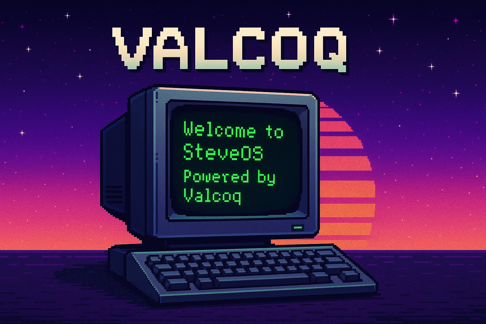

# 🧮 Steve aka Valcoq

<p align="center">
  
</p>

---

## 👾 Über mich

```python
class Valcoq:
    def __init__(self):
        self.name = "Steve"
        self.mission = "Ein guter Entwickler werden"
        self.style = "Clean Code mit Retro-Seele"
        self.current_project = "SteveOS – Retro-Web-Desktop mit Startmenü"
```

- 🎮 Mein Herz schlägt für Retro-Designs, Pixelästhetik und technische Nostalgie
- 🧠 Ziel: Vieles über Softwareentwicklung lernen
- 💾 Ich rekonstruiere, was mich als Kind begeistert hat – nur smarter
- 🛠️ Der Schulrechner SR1 war mein Spielzeug. Jetzt ist er mein Projekt.  
  [👉 Projekt ansehen](https://github.com/Valcoq/SchulrechnerSR1)

---

## 🕹️ Aktuelle Projekte

| Projekt | Beschreibung |
|--------|-------------|
| 🧮 [Schulrechner SR1](https://github.com/Valcoq/SchulrechnerSR1) | Retro-Taschenrechner mit Kindheitserinnerung |
| 🖥️ SteveOS (in Arbeit) | Web-OS im Stil von Windows 95 mit Startmenü, Desktop & Gästebuch |

---

## 📟 Mein Stack

`Python` | `Flask` | `PyQt` | `VS Code` | `Git` | `HTML/CSS` | `TypeScript (bald)` | `Rust (bald)` 
🖱️ Ich liebe GUIs, Dialoge, Klick-Events und alles, was irgendwie wie die 90er wirkt 👾

---

## 🧪 Ziele & Experimente

- 📦 Eigene Flask-Webapps bauen
- 🧠 Design Patterns meistern
- 🕹️ Ein eigenes Spiel entwickeln
- 💿 „SteveOS“ lauffähig machen – inkl. Sound & Easter Eggs

---

## 📊 GitHub Stats

<p align="center">
  
</p>

